# p2-GPUToy: Pràctica 2 2024-25

En aquest fitxer cal que feu l'informe de la pràctica 2. Aneu omplint la informació que us demanem.

## Equip:

**Equip: David Díez (david-diiez), Mario Vilar (mariovilar). F11** 

**Nota:** Per cada estudiant cal indicar el nom complert i l'usuari de GitHub entre parèntesis.

## Informe de progrés

### FITXA 2
#### PAS 1.1.
S'ha modificat el mètode `mouseMoveEvent` de la classe `GLWidget` per incorporar translacions acumulatives de l’escena, a més de les rotacions ja existents.
Concretament, s’han afegit dos atributs nous, `xTras` i `yTras`, per anar acumulant el desplaçament en l’eix X i Y, respectivament.
A cada moviment del ratolí, es detecta si el mode seleccionat a la interfície (`config.mouseMode`) és translació o rotació, i es calcula la matriu de transformació adequada.

Aquesta transformació es compon aplicant primer la translació i després la rotació (o a l'inrevés, segons l'ordre d'interacció), de manera que l'efecte visual sigui coherent i intuïtiu per a l’usuari.

A continuació es mostren diverses imatges que il·lustren aquest comportament:

Rotació sobre les esferes
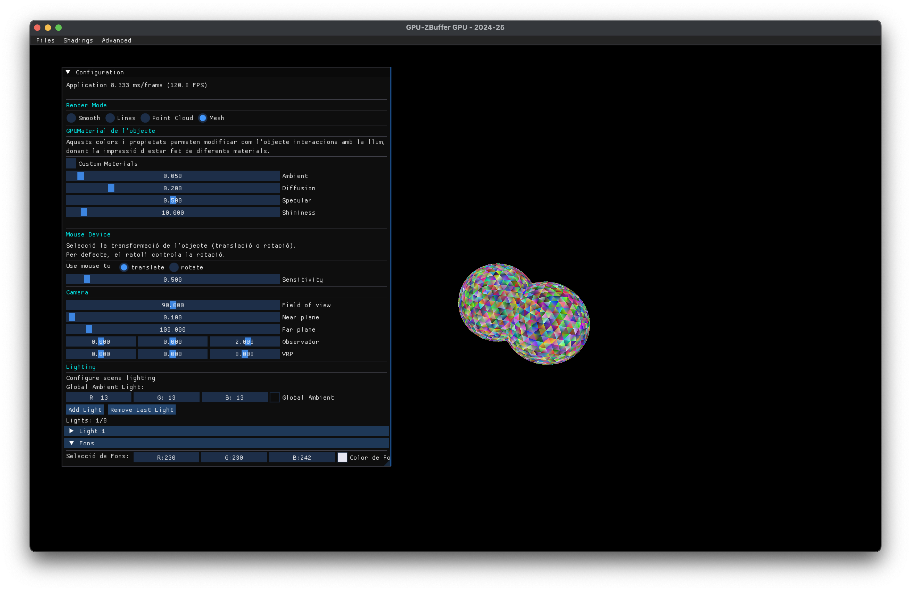

Traslació de les esferes
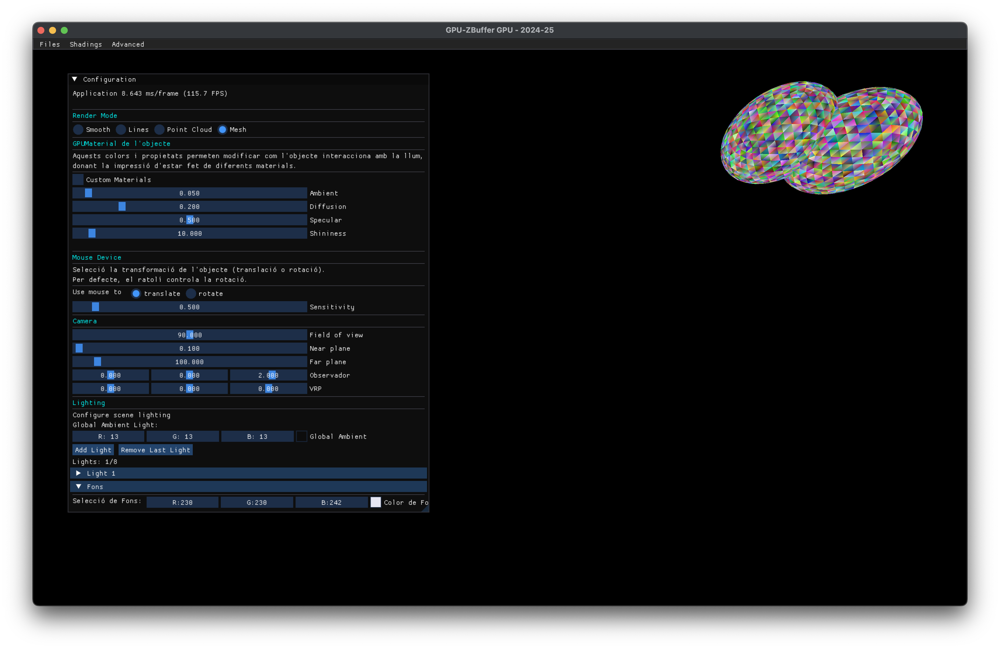

Traslació i rotació de les dues esferes
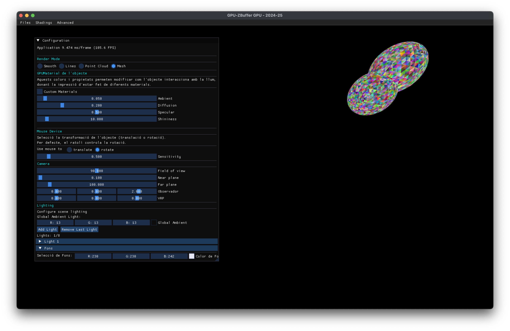


#### PAS 1.2.
En aquest pas s'ha modificat la manera com s'apliquen les transformacions geomètriques per tal que només afectin l'últim objecte carregat, en comptes de tota l'escena. Això permet manipular múltiples objectes de manera independent i coherent. Per aconseguir-ho, s'ha creat una jerarquia de classes per representar transformacions geomètriques (`TG`, `Translate` i `Rotate`) que permeten construir i acumular la transformació final segons els moviments de l’usuari.

A la classe `Object`, s’ha afegit l’atribut `transform`, inicialitzat com a matriu identitat (`glm::mat4(1.0f)`), juntament amb els mètodes `setTransform()` i `getTransform()`, que permeten gestionar la TG individualment per a cada objecte.

Al mètode `draw()` de `GPUScene`, s’aplica la TG de cada objecte abans de dibuixar-lo:

```cpp
aplicaTG(objects.at(i)->getTransform());
objects.at(i)->draw();
```
I a `aplicaTG()`, aquesta `TG` es passa a la GPU mitjançant el uniform `modelMatrix`:
```cpp
GLuint modelMatrixLoc = glGetUniformLocation(program, "modelMatrix");
glUniformMatrix4fv(modelMatrixLoc, 1, GL_FALSE, glm::value_ptr(m));
```
Cada cop que es crea un objecte nou (`loadObject()` o `addCube()`), la transformació acumulada es reinicialitza amb la matriu identitat per evitar comportaments no desitjats:

```cpp
xRot = yRot = zRot = 0.0f;
xTras = yTras = 0.0f;
```

Per comprovar que només es mou el darrer objecte carregat:

Dues esferes bàsiques
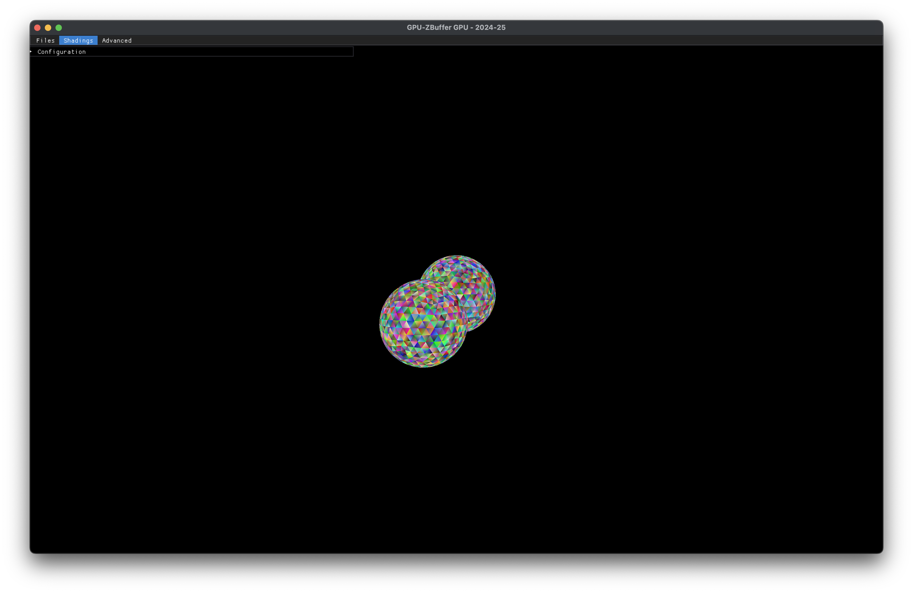

Traslació de només una esfera
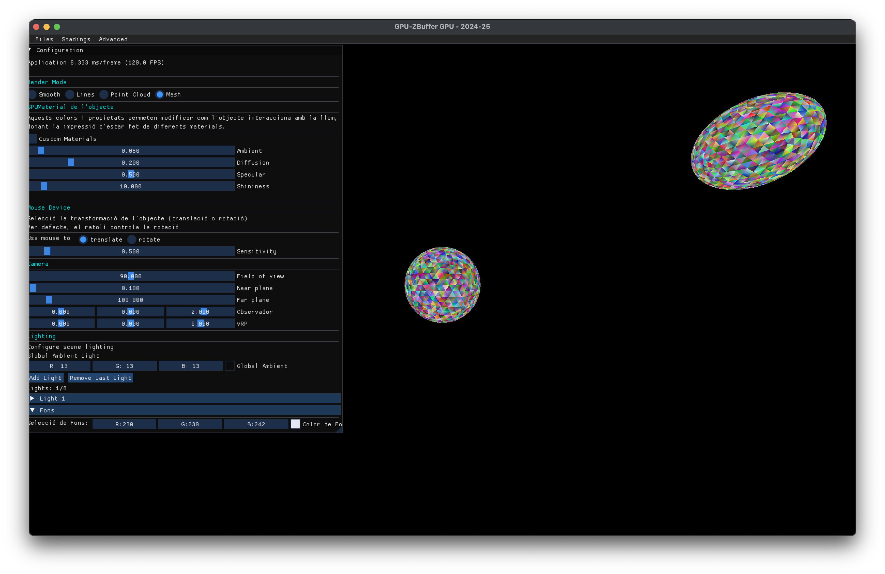

Imatge amb moltes figures mogudes i col·locades de forma aleatoria
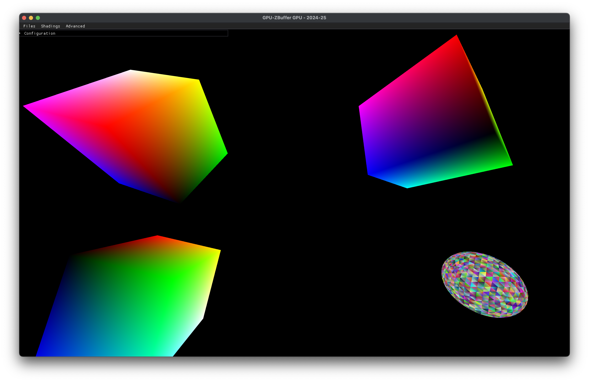

#### PAS 2.1
Ara hem implementat el pas de la llum ambient global a la GPU. Aquesta llum és comuna per a tota l’escena i per tant cal passar-la com a `uniform` als shaders. Hem afegit el següent codi al mètode `ambientLightToGPU()` de la classe `GPULightsManager`:

```cpp
this->globalAmbientLight = a;
GLuint ambient = glGetUniformLocation(program, "globalAmbientLight");
if (ambient == -1) {
    return;
}
glUniform3fv(ambient, 1, glm::value_ptr(this->globalAmbientLight));
```

Aquest mètode es crida des del món virtual (`GPUWorld`) i aquest, al seu torn, és cridat des de `GLWidget` mitjançant `updateGlobalAmbientLight()`, que també es crida des de la interfície gràfica. Així s’actualitza correctament el valor a la GPU.

Per fer-ho visible, hem modificat el shader de colors (`vshader1.glsl`) perquè mostri l’objecte amb el color de la llum ambient global. El vertex shader queda així:

```glsl
uniform vec3 globalAmbientLight;
out vec4 color;

void main()
{
    color = vec4(globalAmbientLight, 1.0);
}
```

I al fragment shader (`fshader1.glsl`) simplement retornem aquest color:

```glsl
in vec4 color;
out vec4 colorOut;

void main()
{
    colorOut = color;
}
```

D’aquesta manera, en activar el shader de tipus "Color" des del menú, l’objecte es pinta amb el color de la llum ambient actual.

Per tal d’inicialitzar aquest valor correctament a l’inici del programa, hem afegit una crida a `updateGlobalAmbientLight()` just després d’activar qualsevol shader, dins de la funció `activateShader()` de `GLWidget`. Això assegura que el valor s’envia a la GPU cada cop que canvia el shader actiu.

Un detall curiós en macOS els canvis als fitxers `.glsl` no es reflectien immediatament i calia reiniciar l’aplicació. Això va ser una petita complicació durant la pràctica.

Imatge amb multiples figures posicionades per tota la pantalla i amb la llum ambient aplicada.
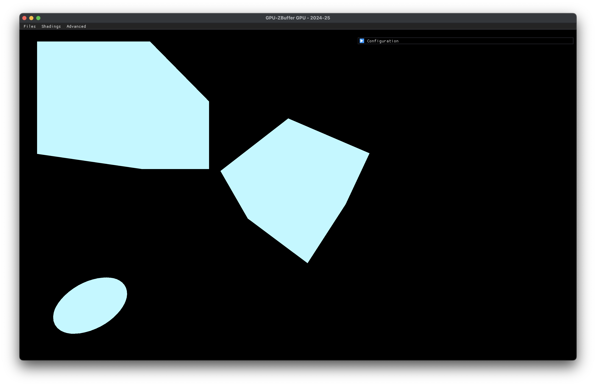

#### PAS 2.2
Hem treballat el pas de les llums puntuals a la GPU utilitzant estructures (`struct`) per encapsular la informació de cada llum: intensitat ambiental, difusa, especular i posició.

Pel que fa al funcionament del codi, el mètode `toGPU()` de la classe `GPULightsManager` és qui s'encarrega finalment d’enviar tota la informació de les llums a la GPU. Aquest mètode es crida des de `updateAllLights()`, també dins de `GPULightsManager` i aquest és invocat des de `GPUWorld`, mitjançant el seu propi `updateAllLights()`.

Finalment, des de la classe `GLWidget`, `updateAllLights()` es crida sempre que s’activa un shader mitjançant `activateShader()`, assegurant que la informació de les llums a la GPU estigui sincronitzada amb l’estat actual de la configuració.

A més, des de `GUIRenderToy` també es crida directament a `updateAllLights()` quan es modifica qualsevol paràmetre relacionat amb la il·luminació, garantint que els canvis es reflecteixin a temps real en la visualització.

Aquesta estructura ens assegura que les llums puntuals es passen correctament a la GPU cada cop que es canvia el shader o qualsevol paràmetre relacionat amb les llums.

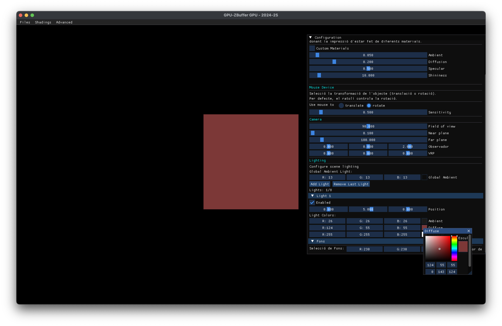

#### PAS 2.3

En aquest pas hem implementat l’enviament d’un conjunt de llums puntuals a la GPU mitjançant un vector d’`structs`, tal com s’ha indicat. Per fer-ho hem implementat el mètode `updateAllLights()` a la classe `GPULightsManager` . Aquest mètode itera sobre les llums actives i, per a cada una, obté les localitzacions dels seus camps a la GPU (utilitzant `glGetUniformLocation`) i envia els valors corresponents amb `glUniform*`. Els `structs` s’han definit al shader com un array de tipus `PointLight` amb una mida màxima fixa (`MAX_LIGHTS`) i inclouen camps com `pos`, `Ia`, `Id`, `Is` i `enabled`.

Per optimitzar l’enviament, s’ha fet que cada llum disposi del seu mètode `updateToGPU(index)`, que permet passar la seva informació de forma individual. Això és útil quan només es modifica una llum i no cal reenviar-les totes, estalviant temps de comunicació amb la GPU.

Respecte a la pregunta de si es comprova si la llum està activada (`enabled`), la decisió es pren dins del shader. Això és més eficient perquè així la GPU pot decidir si ignora o no la contribució d’una llum, sense necessitat de tornar a comunicar-se amb la CPU. Així mateix, cada cop que es canvia un paràmetre d’una llum a la interfície, des de `GUIRenderToy` es crida `updateAllLights()` per enviar les dades actualitzades.

Per comprovar el funcionament, s’han creat tres llums puntuals amb colors diferents i s’han activat/desactivat des de la interfície. Els valors s’han utilitzat com a colors de sortida directament als shaders per verificar visualment que cada llum actua correctament.

Imatge on podem veure l'efecte de les tres llums. Es veu com podem escollir el color de la llum i com s'aplica a la figura.
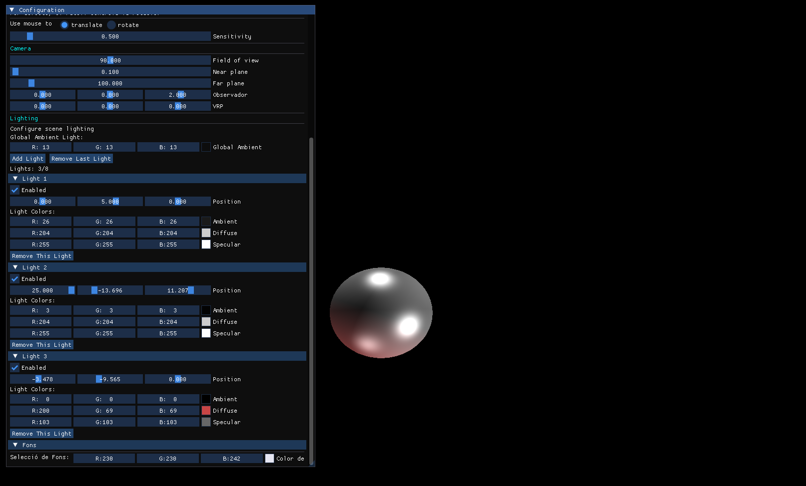

#### PAS 3.1

En aquest pas s’ha treballat el pas dels materials a la GPU. Cada objecte té associat un material propi de tipus `GPUMaterial`, que conté les propietats òptiques clàssiques: component ambient (`Ka`), difusa (`Kd`), especular (`Ks`), coeficient de lluentor (`shininess`) i opacitat (`opacity`).

Per fer-ho, hem implementat el mètode `toGPU()` dins de `GPUMaterial.cpp`, que envia cada atribut del material com a `uniform` a la GPU. El codi és el següent:

```cpp
this->program = program;
struct {
    GLuint Ka;
    GLuint Kd;
    GLuint Ks;
    GLuint shininess;
    GLuint opacity;
} material;
material.Ka = glGetUniformLocation(program, "materialComponents.Ka");
material.Kd = glGetUniformLocation(program, "materialComponents.Kd");
material.Ks = glGetUniformLocation(program, "materialComponents.Ks");
material.shininess = glGetUniformLocation(program, "materialComponents.shininess");
material.opacity = glGetUniformLocation(program, "materialComponents.opacity");

glUniform3fv(material.Ka, 1, glm::value_ptr(this->Ka));
glUniform3fv(material.Kd, 1, glm::value_ptr(this->Kd));
glUniform3fv(material.Ks, 1, glm::value_ptr(this->Ks));
glUniform1f(material.shininess, this->shininess);
glUniform1f(material.opacity, this->opacity);
```

A la GPU, dins del `vMaterial.glsl`, definim l’estructura del material com:

```glsl
struct Material {
    vec3 Ka;
    vec3 Kd;
    vec3 Ks;
    float shininess;
    float opacity;
};

uniform Material materialComponents;
```

El mètode `toGPU()` s'invoca des del `draw()` de la classe `Object`, abans de fer la crida a `glDrawArrays`. Així ens assegurem que el material actiu a la GPU correspon a l’objecte que s’està dibuixant en aquell moment.

Quan es crea un objecte se li assigna un material aleatori per defecte. Aquest material també es pot modificar des de la interfície gràfica, mitjançant el panell de paràmetres òptics que modifica només l'últim objecte afegit.

Els shaders es gestionen des del mètode `initShadersGPU()` de `GLWidget`, on es carreguen tots els parells vèrtex-fragment disponibles. El shader de materials s’anomena `MaterialShader` i s’activa mitjançant `activateShader("Material")`. Quan es fa aquest canvi, es torna a passar tota la informació a la GPU, incloent escenes, càmera i llums.

També s’ha habilitat el rechargement dels shaders en temps d’execució mitjançant l’opció "Reload Shaders" del menú. Aquesta acció torna a cridar `initShadersGPU()` i `activateShader()`, seguit de l’enviament de dades amb `world->toGPU()` i `updateAllLights()` per garantir que el shader nou té tota la informació necessària.

Per verificar que el pas del material funciona correctament hem fet una prova amb el color vermell i el resultat ha sigut exitòs:

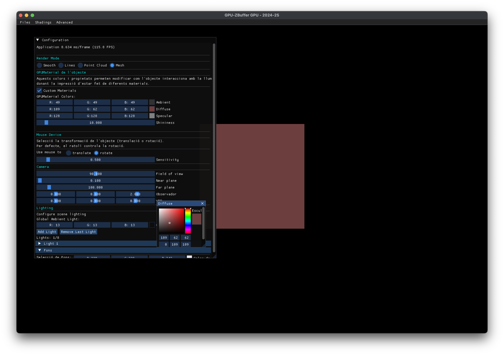


#### PAS 4.1

En aquest pas hem implementat diversos tipus de shading per a la visualització dels objectes, començant pel Normal shading i Phong (Blinn-Phong) i fent la part opcional de Toon i Gouraud. Per a cada shading s’ha creat un parell de vertex/fragment shaders específics, activables des del menú de la GUI.

Pel cas del **Phong shading**, hem aplicat la versió **Blinn-Phong** a `fPhong.glsl`, on es fa el càlcul complet de la il·luminació a nivell de píxel. El shader considera totes les llums actives de l’escena i ignora les que no estan `enabled`. Per fer aquest càlcul, es necessita:

- `FragPos`: posició del fragment en coordenades de món
- `Normal`: normal interpolada, també en coordenades de món
- `viewPos`: posició de l’observador

Aquests valors es passen des del vertex shader (`vPhong.glsl`), on es fa la transformació de la normal amb la inversa transposada de la `modelMatrix`, mantenint les coordenades en espai de món.
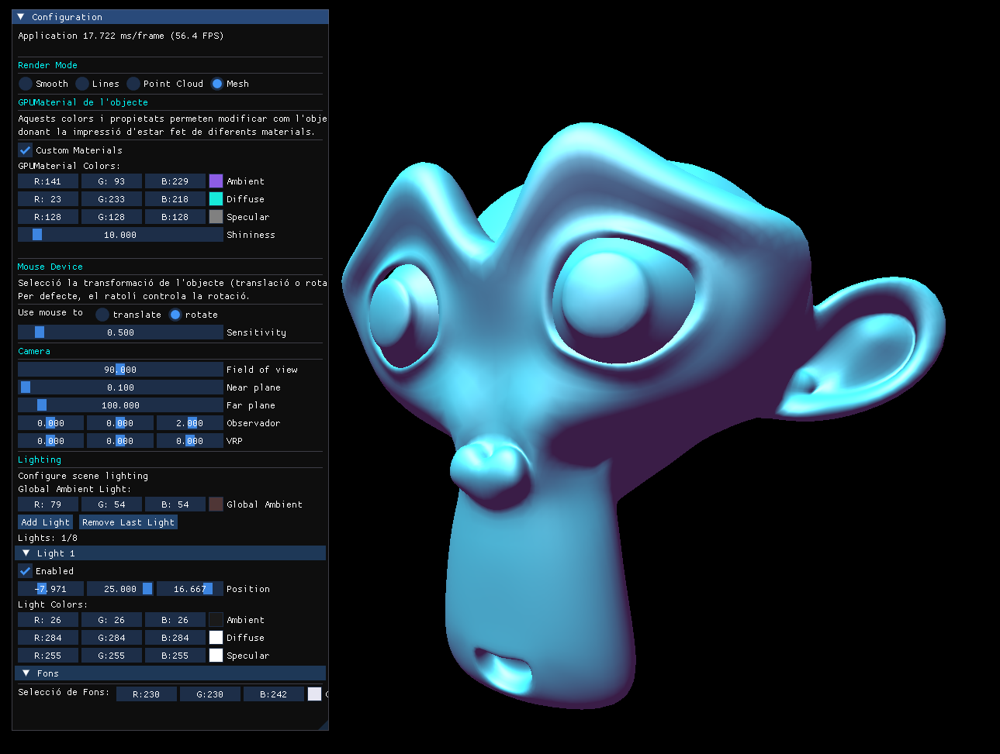


També hem implementat el **Normal shading**, on es pinta cada fragment segons la seva normal. Això es fa interpolant les normals definides per vèrtex i mostrant-les com a color al fragment shader.
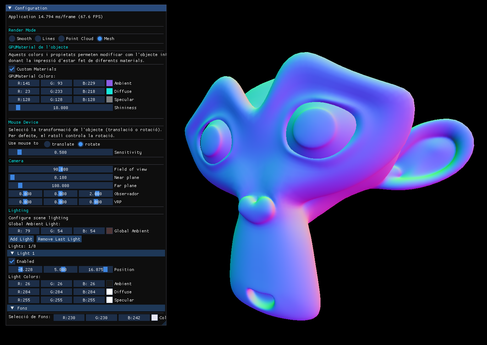

Hem afegit el **Gouraud shading**, en què tota la il·luminació es calcula al vertex shader. El color resultant s’interpola automàticament als fragments interiors del triangle. El càlcul també segueix el model Blinn-Phong, però traslladat completament al vertex shader.
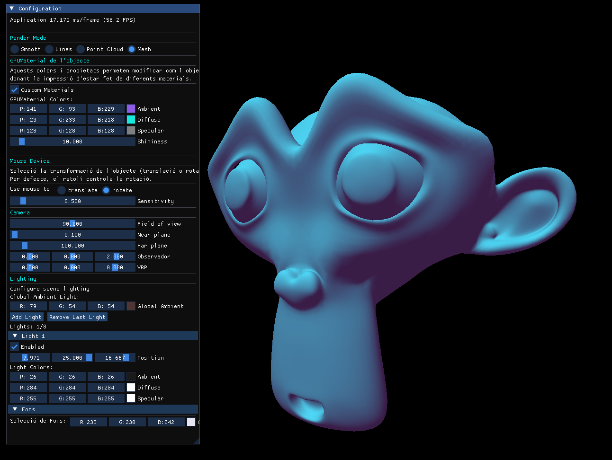

Finalment, també hem implementat el **Toon shading** En aquest cas el càlcul de la il·luminació es fa al fragment shader i es discretitza la il·luminació difusa en trams predefinits.
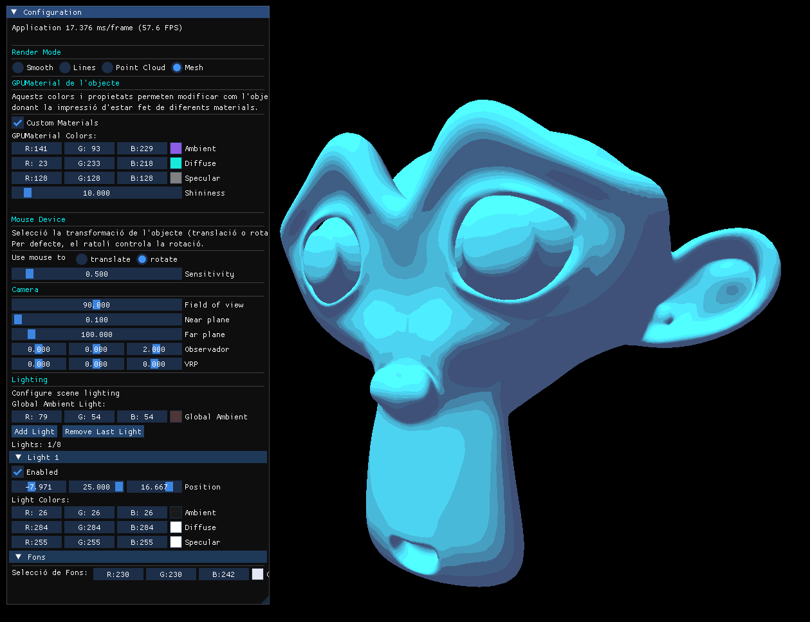

Cadascun dels shaders es pot activar des del menú "Shadings" de la GUI. En fer-ho, es crida el mètode `activateShader()` que torna a passar tota la informació necessària a la GPU.


### FITXA 3
#### PAS 1.1.

Els resultats d'aquesta pregunta son els següents:
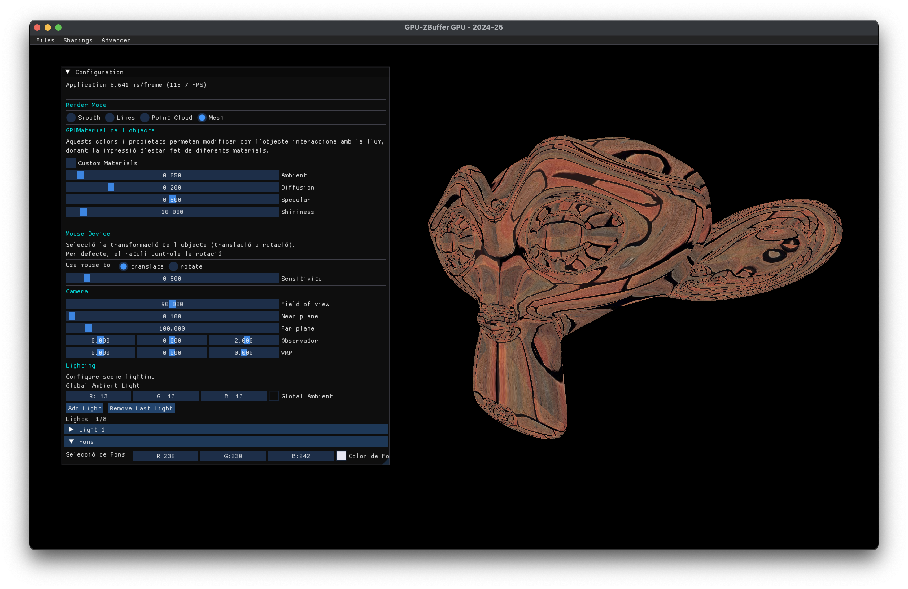


#### [OPT] Mapping indirecte de textures

Per permetre la visualització d'objectes amb textura encara que no tinguin coordenades de textura definides, hem implementat el mapping indirecte. Hem creat el mètode `generateTextureCoordinates()` dins de la classe `Object`, que calcula les coordenades `(u, v)` per a cada vèrtex a partir de la seva posició relativa al centre de l’objecte, normalitzant aquesta direcció per projectar-la sobre una esfera.

Aquesta funció es crida automàticament des de `GPUScene::initTextureGL()` quan un objecte no té ja coordenades de textura. Així garantim que, tant si venen del fitxer `.obj` com si no, tots els objectes poden ser texturitzats

```cpp
void initTextureGL(const char *nomTextura) {
    for (auto obj : objects) {
        // Si l'objecte no té textura, generem coordenades de textura esferiques
        if (!obj->isTextured()){
            obj->generateTextureCoordinates();
        }

        // Inicialitzem la textura
        obj->initTextureGL(nomTextura);
    }
}
```
A continuació es mostren imatges d’objectes amb mapping indirecte activat:

Indirect mapping aplicat a l'esfera, que no té coordenades de textura
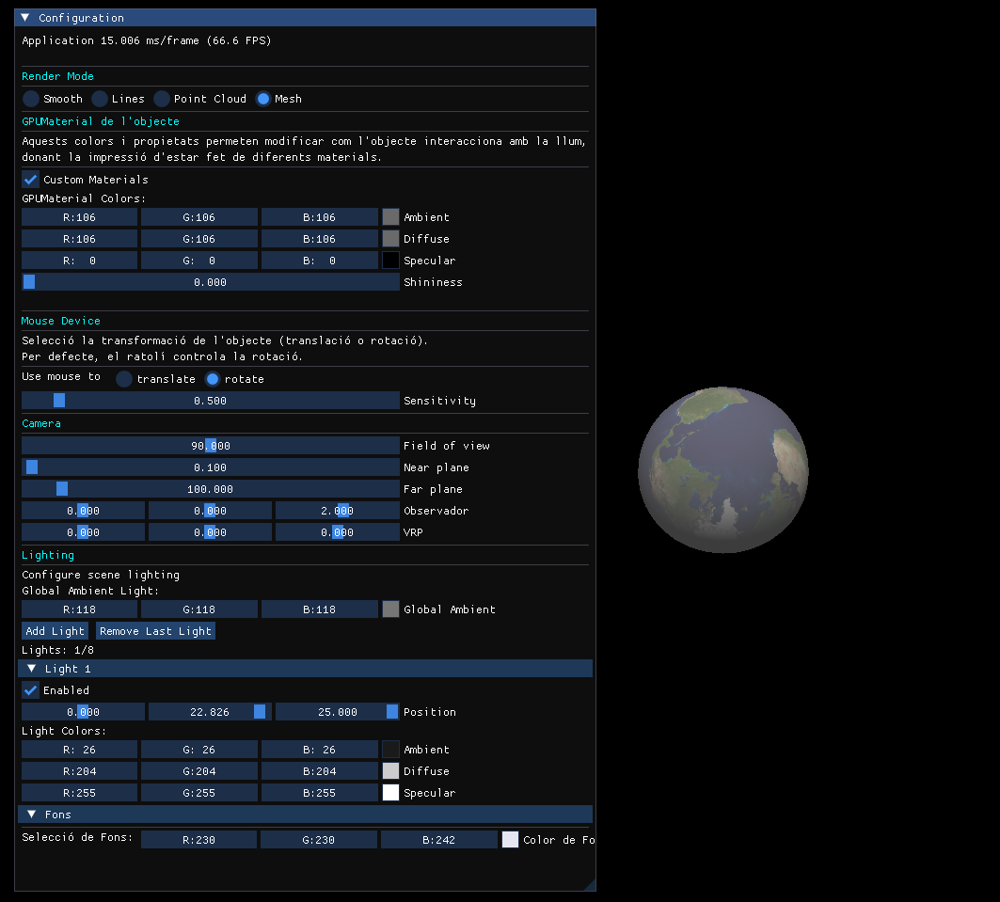  

Indirect mapping aplicat a l'esfera i renderització normal del mico (que sí que té coordenades de textura)  
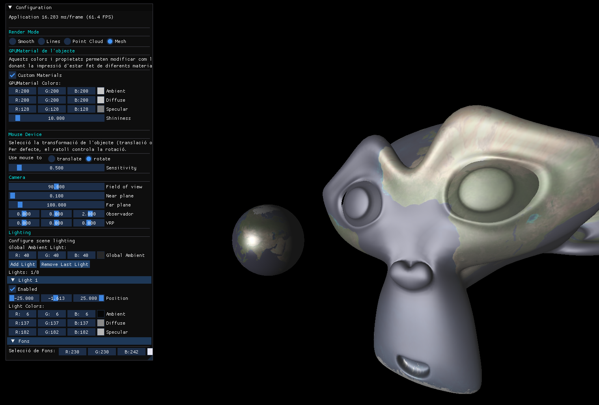


#### [OPT] Textura per objecte

Per fer que cada objecte tingui la seva pròpia textura, hem modificat el mètode `initTextureGL()` de la classe `GPUScene` per tal que només s’apliqui la textura a l’últim objecte carregat en lloc de fer-ho sobre tots els objectes de l’escena:

```cpp
void initTextureGL(const char *nomTextura) {
    if (objects.empty()) return;
    
    // Per poder tenir textures diferents per cada objecte, només l'últim rep la textura
    shared_ptr<Object> lastObject = objects.back();
    
    if (!lastObject->isTextured()) {
        lastObject->generateTextureCoordinates();
    }

    lastObject->initTextureGL(nomTextura);
}
```

Aquesta modificació ens permet carregar una textura nova cada cop que es carrega un objecte, mantenint-la independent de les textures dels objectes anteriors. Així, en escenes amb múltiples objectes cadascun pot tenir la seva pròpia textura.

Tot i això, vam detectar un problema: si un objecte no tenia coordenades de textura en el shader de Phong amb textura, no es mostrava correctament. La solució va ser modificar el mètode `toGPUTexture()` a `GPUScene.cpp`, afegint una comprovació per generar les coordenades de textura si no hi són:

```cpp
void GPUScene::toGPUTexture(GLuint p) {
    this->program = p;
    for (unsigned int i = 0; i < objects.size(); i++) {
        // En cas de no estar texturitzat, generem coordenades de textura
        if (!objects.at(i)->isTextured()) {
            objects.at(i)->generateTextureCoordinates();
        }
        objects.at(i)->toGPUTexture(program);
    }
}
```

Amb aquesta solució, qualsevol objecte (tant si porta coordenades de textura definides com si no) pot tenir assignada la seva pròpia textura de forma independent i funcional.

A continuació es mostren exemples d’objectes amb textures independents aplicades.

Aquesta imatge conté dues figures amb una textura bàsica cadascuna
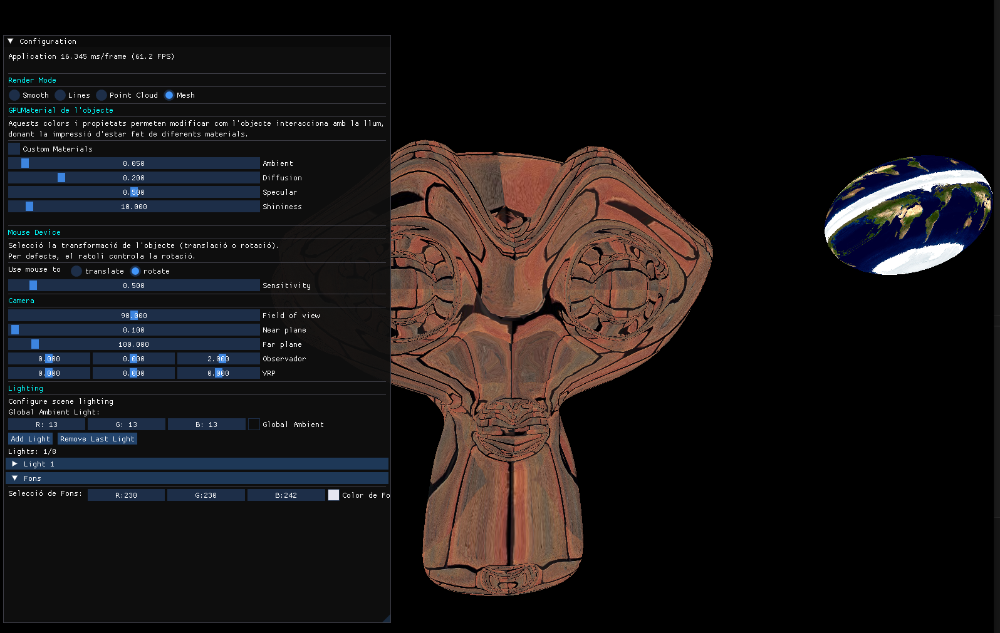  

Les següents dues imatges han sigut generades amb textura i Blinn-Phong. S'utilitzen diferents textures a les dues imatges per veure que funciona bé
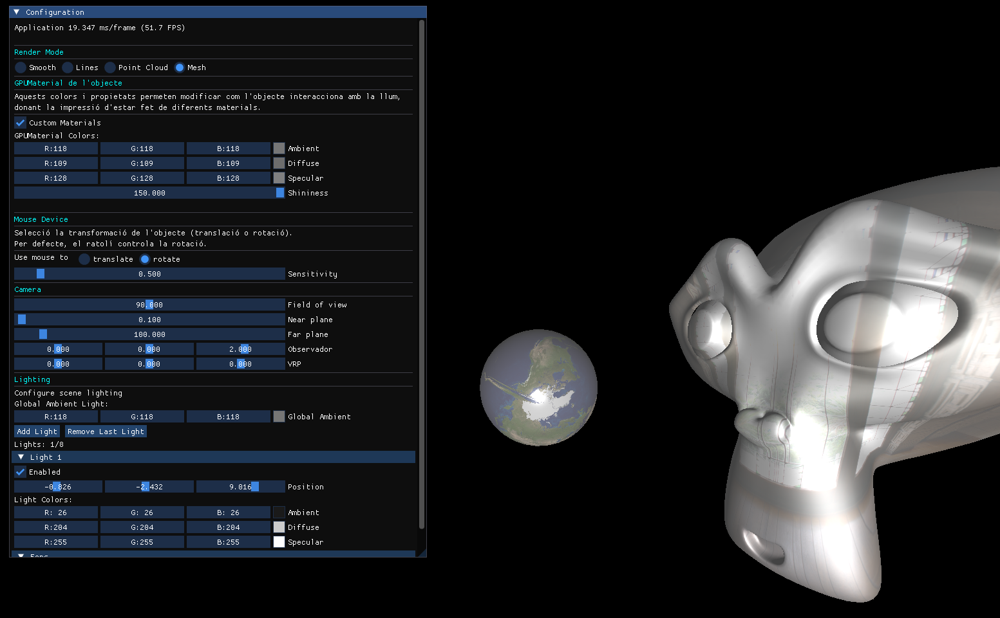  
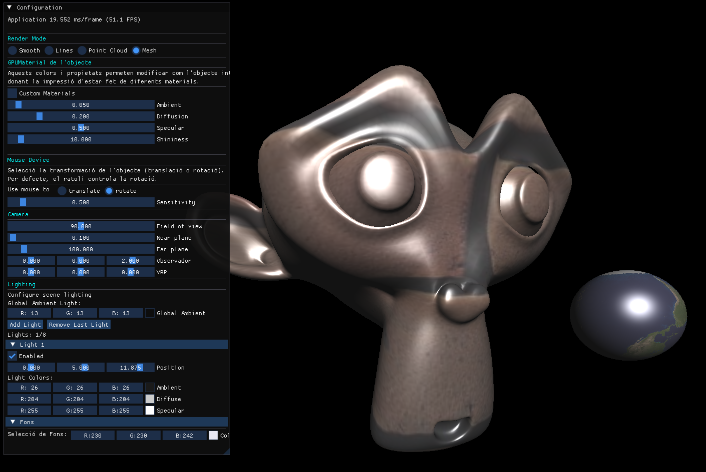

Aquesta última imatge conté tres figures i cadascuna amb una textura diferent
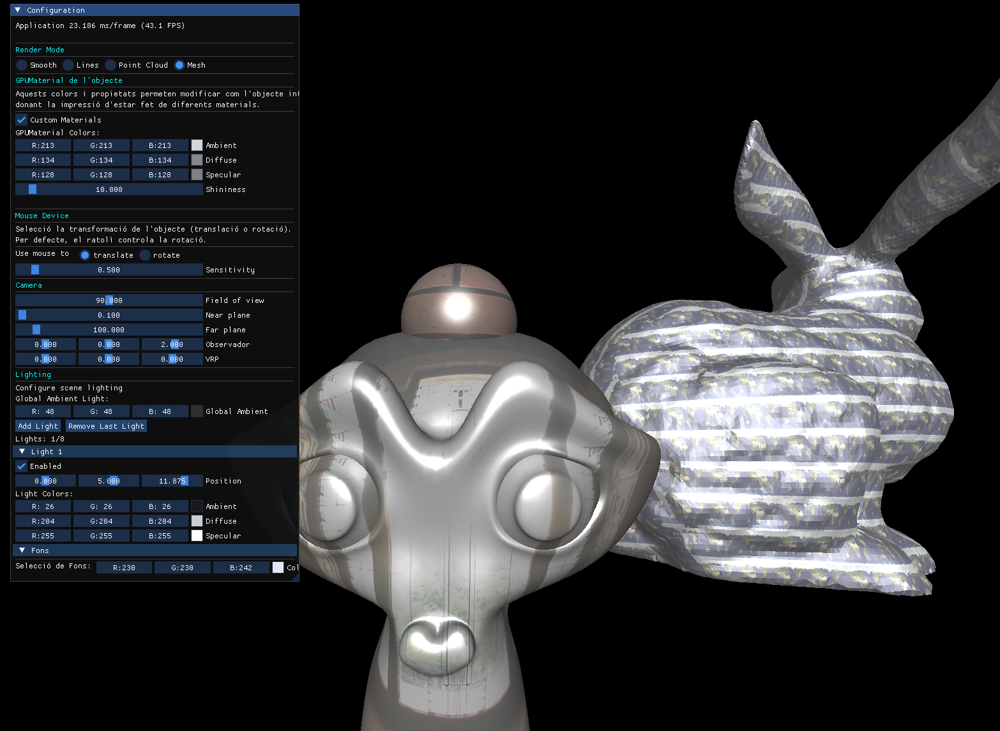


### Features (marqueu les que heu fet i qui les ha fet)

- Fitxa 2:
    - [X] PAS 1
        [X] PAS 1.1. Càlcul translacions de l’escena	
        [X] PAS 1.2. Mou només el darrer objecte que s’ha carregat
        - Estudiants que hi han participat: David Díez i Mario Vilar
    - [X] PAS 2: Pas de les llums a la GPU	
        [X] PAS 2.1. Pas de la llum ambient global a la GPU	
        [X] PAS 2.2. Pas d’una llum de tipus puntual a la GPU	
        [X] PAS 2.3. Pas d’un conjunt de llums a la GPU	
        - Estudiants que hi han participat: David Díez i Mario Vilar
    - PAS 3. Modificació de la classe Material i pas a la GPU dels valors de materials	
        [X] PAS 3.1. Modificació de la classe Material	
        - Estudiants que hi han participat: David Díez i Mario Vilar
    - PAS 4. Implementació de shadings (Normal i Phong shading)	
        [X] PAS 4.1. Normal Shading
        [X] PAS 4.1. Phong shading
        - Estudiants que hi han participat: David Díez i Mario Vilar	
    
- Fitxa 3:
    - [X] PAS 1. Textures
    - Estudiants que hi han participat: David Díez i Mario Vilar

- Opcionals:
  - [X] Gouraud shading
  - [X] Cel o Toon Shading (tècnica no realista)
  - [ ] Èmfasi de siluetes
  - [ ] Càrrega de materials des de mtl
  - [X] Textures per objecte
  - [X] Indirect mapping
  - [ ] Environmental mapping
  - [ ] Reflexions amb el background
  - [ ] Transparències amb el background


### Explicació de la pràctica    
  * **Organització de la pràctica**
    * Descriu com us heu organitzat: Hem fet el treball de forma conjunta, acostumàvem a quedar a casa d'algun dels dos i treballar en conjunt.
    
  * **Decisions a destacar**
    * Comenteu les decisions que heu pres: Totes les decisions necessàries ja s'han comentat en la secció anterior on expliquem el desenvolupament de la pràctica.

### Screenshots

Per tal de documentar els vostres resultats, és important que adjunteu imatges amb el resultat i quan convingui, captures de pantalla amb la configuració que el genera. Per totes les imatges cal incloure un peu d'imatge indicant què es mostra, i tota la informació necessària per reproduïr l'imatge (la configuració, els objectes i les seves propietats, llums, ...)