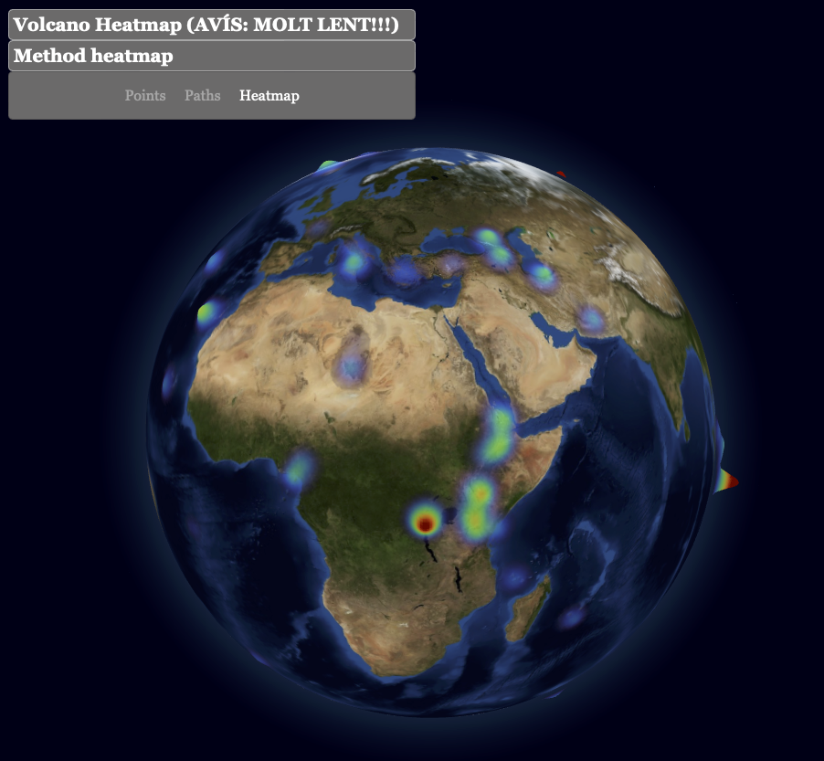
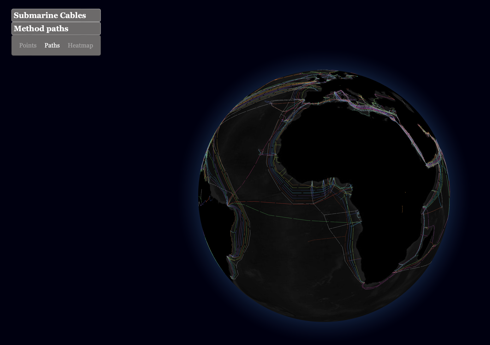
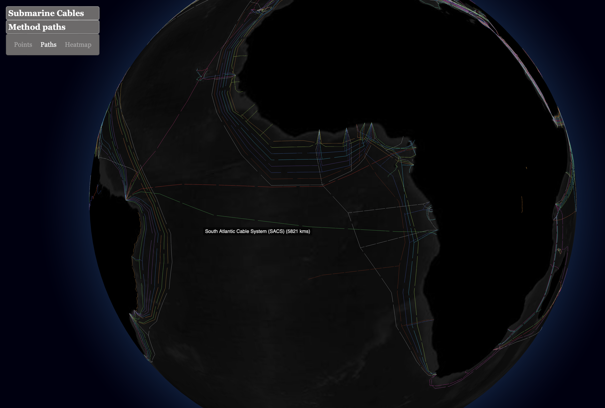
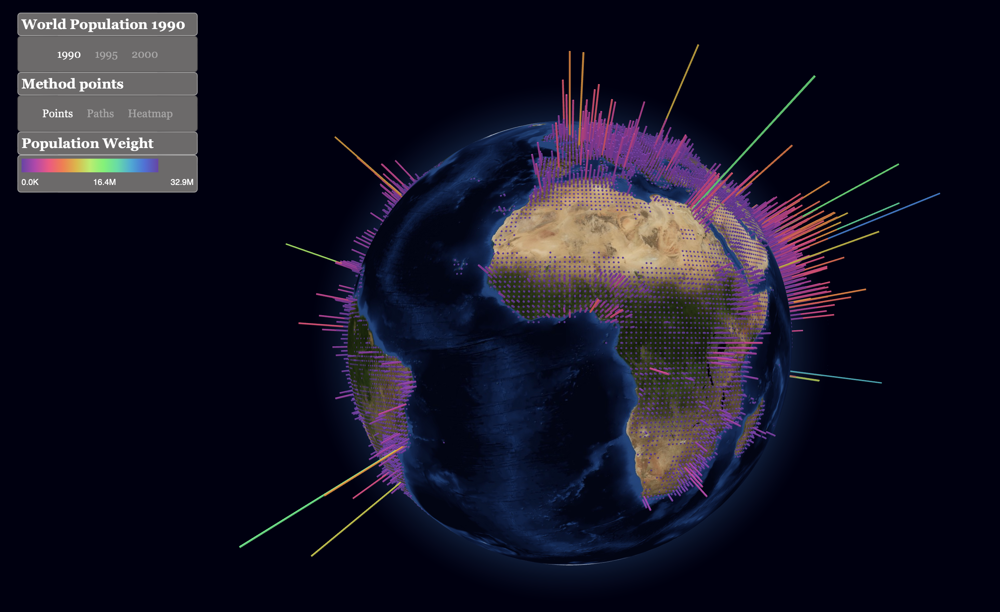

# P3-Globe-GL-Vis

## Explicació fonamental
1. Busquis un conjunt de dades geolocalitzades. Poden ser temporals o no i poden tenir connexions entre elles o no. Per un mateix punt (una latitud i longitud) pots tenir un o varis valors (Escalars o vectorials).

**Resposta**: El conjunt de dades que usarem ve donat en un cert exemple de `Globe.gl` (https://github.com/vasturiano/globe.gl/tree/master/example/submarine-cables), en el qual s'exploren i projecten les connexions cablejades submarines del món. Veurem com moltes ciutats acaben interconnectades.

2. Exploris el tipus de dades que tens (What?): són categòriques, són ordinals, són quantitatives? Quina dimensió tenen? Tenen temporalitat? Estan interconnectades?

**Resposta**: Hem de dividir la resposta segons els diferents atributs del JSON obtingut. 
*   **Spatial**. El tipus de dades que tenim és una `geometry` (spatial), amb nodes que són posicions.
*   **IN: Dades Geolocalitzades (Quantitatives, Espacials)**: `geometry` és un atribut de cada cable que conté una sèrie de coordenades geogràfiques (latitud i longitud) que tracen la seva ruta. És a dir, una llista de posicions sobre la superfície on cada node està connectat amb l'anterior i el següent. Aquestes són dades quantitatives discretes. A partir d'aquestes dades geomètriques, es podria **derivar** un atribut quantitatiu continu addicional com resulta ser la **longitud** de cada cable.

*   **IN: Propietats dels Cables, totes categòriques**:
    *   `name`: Dada categòrica.
    *   `id`: Dada categòrica.
    *   `color`: Dada categòrica.
*   **Dimensió**: Suposarem que la pregunta es refereix simplement a les dades geolocalitzades, ja que altrament no tindria sentit. Les coordenades són 2D (latitud, longitud), però la visualització es fa sobre un globus 3D. Veurem com cada cable és una corba mapejada en aquest espai.
*   **Temporalitat**: El conjunt de dades base de l'exemple no emfatitza la temporalitat (com l'any de construcció de cada cable), però aquesta dimensió podria afegir-se si les dades ho permeten i, en tal cas, estaríem davant una dada categòrica.

_Observació:_ Els cables no són sinó una successió de punts que quedaran representat com una poligonal projectada sobre una esfera. Cada cable està format, com a mínim, per origen i extrem, pel que cada punt està connectat. De fet, també podrem veure com existeix algun punt per on passa un feix de cables. Al cap i a la fi, tots aquests punts representaran una xarxa de cables que connectaran diferents punts del globus. L'objectiu principal és visualitzar aquestes connexions.

```JSON
{"id":"fibre-in-gulf-fig","name":"Fibre in Gulf (FIG)","color":"#939597","feature_id":"fibre-in-gulf-fig-0","coordinates":[53.05222387166369,25.82851006776677]},"geometry":{"type":"MultiLineString","coordinates":[[[47.97630977972595,29.371633383730508],[48.33207124645109,29.57074954758684],[48.5317798555716,29.92363278689715],[50.21426199999971,27.106120810916483],[51.739002426699074,26.463743320783486],[52.30775202379166,26.127977645442854],[53.55232247961318,25.627342865608828],[55.011461045958754,25.756582329883276],[56.279233634860766,26.60351617488129],[56.72184066493084,26.51048843368535],[57.18147788063447,24.202309555449286],[57.88605322832058,23.67872342575357]],[[53.55232247961318,25.627342865608828],[54.419075684956134,24.443964572625426]],[[51.46310743050667,26.56481484059615],[51.212749,26.146578371109786]],[[50.85003821329572,26.82364558689702],[50.65618835062081,26.25817095672994]],[[50.51253845238375,26.964304734562898],[50.214198663730556,26.28537535931817]]]}
```

3. Defineixis l’objectiu de la teva visualització (Why?): analitzar (descobrir tendències, outliers), cerca de valors, comparar, resumir, etc. Defineix un parell {action, target} per a dissenyar i justificar la teva visualització (mira la diapositiva 42 de teoria).

**Resposta**: L'objectiu principal de la visualització és permetre l'exploració interactiva i la comprensió de la distribució global i la topologia de la xarxa de cables submarins. Aquest objectiu tan clar ens permet descartar nombrosos accions i targets, ja que no tenim necessitat de crear noves mètriques o atributs derivats; és a dir, de generar nova informació a partir de la aportada per la _raw data_ del JSON. Per assolir-ho, no en tenim prou amb un parell. Definim els següents parells {acció, objectiu}:

*   **Parell 1**:
    *   **Acció (Action)**: `Analyze -> Consume -> Discover` (Descobrir)
    *   **Objectiu (Target)**: `Network Data -> Topology` (la topologia de la xarxa de cables) i `All Data -> Features` (les característiques generals de la seva distribució).
    *   **Justificació**: La visualització permet a l'usuari explorar lliurement el globus per descobrir com s'estructuren les connexions dels cables submarins a nivell mundial, identificant la forma general de la xarxa.
    *   **Nota important**: hem considerat que l'objectiu de descobrir la `Topology` ja implica l'observació i comprensió dels `Paths`, ja que no pots entendre realment la topologia global de la xarxa de cables sense observar les rutes individuals que segueixen aquests cables.

*   **Parell 2**:
    *   **Acció (Action)**: `Search -> Location unknown, Target unknown -> Explore` (Explorar)
    *   **Objectiu (Target)**: `Spatial Data -> Shape` (la forma i distribució espacial dels cables sobre el globus).
    *   **Justificació**: L'usuari pot navegar interactivament pel globus 3D per explorar visualment on es localitzen els cables i com es relacionen geogràficament amb l'orografia dels oceans, entenent la seva extensió i abast.

*   **Parell 3**:
    *   **Acció (Action)**: `Query -> Identify` (Identificar)
    *   **Objectiu (Target)**: `Attributes -> One` (l'atribut de nom del cable concret).
    *   **Justificació**: Mitjançant interaccions com passar el cursor (hover) sobre un cable, l'usuari pot identificar cables individuals i obtenir el seu nom, ajudant a entendre els components individuals que conformen la xarxa global.

*   **Parell 4 (Amb Derivació)**:
    *   **Accions (Actions)**: 
        1.  `Analyze -> Produce -> Derive` (Derivar la longitud de cada cable a partir de les seves coordenades).
        2.  `Query -> Compare` (Comparar les longituds dels cables) o `Analyze -> Consume -> Discover` (Descobrir patrons o tendències en les longituds).
    *   **Objectius (Targets)**: 
        1.  `Attributes -> One` (L'atribut quantitatiu derivat: "longitud del cable").
        2.  `Attributes -> Many` (Comparar l'atribut longitud entre diversos cables) o `All Data -> Trends / Outliers` (Identificar els cables més llargs/curts, o tendències regionals en longitud).
    *   **Justificació**: Derivar la longitud dels cables permet una anàlisi més rica, com identificar els cables transoceànics més extensos, comparar la inversió en infraestructura per longitud entre diferents operadors (si aquesta dada estigués disponible), o analitzar la distribució de longituds per trobar valors atípics. Aquesta informació derivada no és directament visible a les dades originals.

4. Defineixis un o més mappings visuals que et permetin visualitzar les dades de la millor manera possible, de forma justificada segons l’objectiu i les teves dades (How?).

**Resposta**: Per assolir els objectius definits, s'utilitzen els següents mappings visuals:
1.  **Context Global**:
    *   **Mapping Visual (How?)**: Un model 3D texturitzat del globus terraqüi com a fons (ja ens ve donat).
    *   **Justificació**: Ja que si no tindria sentit, no seríem capaços de veure on està projectada la nostra informació.

2.  **Dada**: Trajectòria geogràfica de cada cable submarí (coordenades latitud/longitud).
    *   **Mapping Visual (How?)**: Línies o arcs dibuixats sobre la superfície del globus terraqüi. `Globe.gl` utilitza la capa `pathsData` per a això.
    *   **Justificació**: Les línies són la representació més directa i intuïtiva per a connexions i rutes entre punts geogràfics. La composició de l'aplicació que parametritza l'esfera amb les coordenades locals de la corba ens dona la traça de la corba sobre la superfície.

3.  **Dada**: Nom del cable (categòrica).
    *   **Mapping Visual (How?)**:
        *   **Color**: Es pot assignar un color diferent a cada cable (utilitzant la propietat `color` del JSON) o a grups de cables si es definissin categories addicionals.
        *   **Tooltips/Etiquetes**: En interactuar amb un cable (p. ex., hover), es mostra una etiqueta o tooltip amb el seu nom i altres propietats rellevants (com la longitud derivada).
    *   **Justificació**: El color és un canal visual efectiu per a la diferenciació categòrica. Els tooltips proporcionen detalls sota demanda (`details-on-demand`) per a l'acció d'`Identify`.

4.  **Dada (Derivada/Potencial)**: Longitud del cable (quantitativa), capacitat, antiguitat o importància d'un cable.
    *   **Mapping Visual (How?)**:
        *   **Gruix de la línia (Stroke width)**: Línies més gruixudes per a cables més llargs o de major capacitat. Aquest és un mapping especialment intuïtiu per a la longitud derivada.
        *   **Intensitat del color / Opacitat**: Variacions per reflectir alguna magnitud quantitativa.
    *   **Justificació**: Aquests canals visuals (mida, intensitat) són adequats per a representar dades quantitatives o ordinals, permetent `Comparar` visualment atributs dels cables o `Descobrir` tendències basades en aquests atributs derivats o existents.

## Resposta a algunes preguntes
- Com es carrega la textura del globus terraqüi?

**Resposta**: La textura del globus es carrega a `index.html` utilitzant `THREE.TextureLoader().loadAsync('./resources/earth-day.jpg')`. Aquesta textura s'aplica després a un `THREE.ShaderMaterial` que, al seu torn, s'utilitza com a material del globus (`world.globeMaterial(material)`).

- On es defineix la geometria definida per a representar els valors d'un punt?

**Resposta**: La geometria per representar els valors d'un punt es defineix implícitament per la llibreria `globe.gl`. Quan s'utilitza el mètode `.pointsData()` i es configuren propietats com `.pointAltitude()`, `.pointColor()` i `.pointRadius()` a `index.html`, la llibreria s'encarrega de generar la geometria necessària (probablement esferes o cilindres petits) per a cada punt de dades.

- On es calcula el valor del color a cada punt?

**Resposta**: El valor del color per a cada punt es calcula a `index.html` dins de la funció `mappingSelectedData`. S'utilitza una escala de color (`weightColor`) creada amb `d3-scale` (`scaleSequential(interpolateRainbow)`) que mapeja el valor de la població (`d.population`) a un color. Aquest color s'assigna mitjançant `.pointColor(d => weightColor(d.population))`.

- S’usa un shader per pintar les barres que representen les dades del fitxer JSON?

**Resposta**: El codi proporcionat se centra en la visualització de dades com a punts sobre el globus. No hi ha una implementació explícita de barres per representar les dades del fitxer JSON ni shaders personalitzats per a barres. La visualització de "punts" utilitza les funcionalitats de `globe.gl` que internament podrien fer servir shaders, però no es defineixen shaders específics per a barres en el codi mostrat.

- On s'inicialitzen les variables dels shaders?

**Resposta**: Les variables (uniforms) del shader bàsic per a la textura del globus s'inicialitzen a `index.html` quan es crea el `THREE.ShaderMaterial`. Específicament, l'uniform `textureMap` s'inicialitza amb la textura carregada: `uniforms: { textureMap: { value: texture } }`.

- Quin shader es fa servir per pintar el globus?
**Resposta**: Per pintar el globus s'utilitza un shader personalitzat definit a `util.js` dins de la constant `basicShaders`. Aquest consisteix en un `vertexShader` i un `fragmentShader`. El `fragmentShader` és el responsable de pintar el globus aplicant la textura: `vec4 diffuse = texture2D(textureMap, vUv); gl_FragColor = diffuse;`. Pel que fa al tipus, sembla ser un Texture Shader molt bàsic.


## Com...
1. Canviar el color de visualització de les barres associades a cada dada

**Resposta**: Per canviar el color de visualització dels punts (que en aquest context funcionen de manera similar a barres, ja que tenen alçada), cal modificar la funció `mappingSelectedData` al fitxer `index.html`. En particular, la línia `.pointColor(d => weightColor(d.population))` determina el color. Com a opcions, podem canviar la funció `weightColor` o la propietat que s'hi mapeja. Per exemple, per utilitzar una escala de colors a `d3-scale-chromatic` diferent de `interpolateRainbow` (buscant, hem trobat moltíssimes alternatives, com la `interpolateSinebow`, la `interpolatePuOr` o la `interpolateViridis`), podríem intercanviar `const weightColor = scaleSequential(interpolateRainbow)` per `const weightColor = scaleSequential(interpolateSinebow)`. Més alternatives, tot i que poc ideals, podrien ser interpolar i usar un esquema de colors fixos o bé deixar un únic color.

2. Canviar l'alçada de la barra a la que es refereix cada dada

**Resposta**: Per canviar l'alçada dels punts/barres, hem de modificar la funció `mappingSelectedData` al fitxer `index.html`. La línia `.pointAltitude((d) => (d.population - minWeight)/(maxWeight - minWeight))` estableix l'alçada normalitzant la població entre 0 i 1. Podem ajustar la fórmula de càlcul per escalar les alçades de manera diferent. Per exemple, per fer les barres més altes, podríem multiplicar el resultat: `.pointAltitude((d) => ((d.population - minWeight)/(maxWeight - minWeight)) * 1.5)`.

3. Canviar la textura del globus terraqüi. Podem agafar alguna de les textures utilitzades a la pràctica 2 o de la que trobis per internet.

**Resposta**: Per canviar la textura del globus, hem de modificar la línia on es carrega la textura al fitxer `index.html`, tot buscant `new THREE.TextureLoader().loadAsync('./resources/earth-day.jpg')` i canviant per la textura corresponent.

4. Canvia el json per a que es visualitzin altres dades geolocalitzades. Cerca per Internet dades a visualitzar que tinguin informació geogràfica. Per exemple, a https://github.com/mwgg/Airports Podem trobar el fitxer airports.dat amb dades dels aeroports del món, però cal que busquis d’altres dades per visualitzar.

**Resposta**: Haurem d'actualitzar la càrrega de dades i adaptar la funció `parseData`. És molt probable que l'estructura del nou JSON sigui diferent. Necessitarem un objecte on les claus són anys o categories, i els valors són arrays d'objectes amb `lat`, `lng`, i la propietat que volem visualitzar, per exemple, `population` o `magnitude`.

5. Canvia el html per a que es correspongui amb les dades que estàs visualitzant amb aquest nou JSON.

**Resposta**: Haurem de fer diversos canvis a `index.html` per reflectir les noves dades:
    a. **Títols i etiquetes**: Actualitzar els títols com `yearTitle`, `visTitle`, `legendTitle`.
    b. **Selectors d'any/categoria**: Si les noves dades no s'organitzen pels mateixos anys que abans haurem de canviar els `<span>` amb `id="1990"`, etc., a la secció `yearList` per a què es corresponguin amb les claus del nou `dataObject`.
    c. **Propietats de les dades**: A la funció `mappingSelectedData`, assegurar-se que les propietats utilitzades (`d.population`, `d.lat`, `d.lng`) coincideixen amb els noms de les propietats del teu nou conjunt de dades després de ser processades per `parseData`. Per exemple, si la magnitud es diu `magnitude` en lloc de `population`, caldrà canviar `.map(d => d.population)`, `.pointAltitude((d) => (d.population - minWeight)/(maxWeight - minWeight))`, i `.pointColor(d => weightColor(d.population))`.
    d. **Informació del Tooltip**: Actualitzar la funció `getTooltip` per mostrar la informació rellevant de les teves noves dades.
    e. **Llegenda**: La funció `updateLegend` també haurà de ser coherent amb les noves dades i la magnitud que s'està representant.

## Extra: Implementació d'un Heatmap de Volcans

Com a exercici addicional per explorar diferents mètodes de visualització, vam intentar implementar un heatmap basat en la localització i elevació de volcans a nivell mundial. Per a això, ens vam inspirar en l'exemple de [Volcanoes Heatmap](https://github.com/vasturiano/globe.gl/tree/master/example/volcanoes-heatmap) de la llibreria `globe.gl`.

L'objectiu era representar la densitat o intensitat dels volcans utilitzant l'elevació com a variable quantitativa contínua per ponderar cada punt del heatmap. No obstant això, durant la implementació vam trobar dificultats significatives relacionades amb el rendiment. La càrrega i el processament de les dades dels volcans per generar el heatmap resultaven en temps d'execució molt elevats, fent que la interacció amb el globus fos lenta i poc fluida. Tot i que el navegador suggeria l'ús de WebGL (Web3D) per millorar el rendiment, aquesta optimització no va ser suficient per resoldre els problemes de lentitud de manera satisfactòria.

Pel que fa a la paleta de colors del heatmap, aquesta es basa en una interpolació contínua per representar la intensitat. Degut als problemes de rendiment esmentats, que dificultaven iterar i provar diferents configuracions visuals de manera àgil, vam optar per utilitzar la paleta de colors per defecte que ofereix `globe.gl` per als heatmaps. No vam poder dedicar temps a personalitzar-la o ajustar-la per a deixar-la com als Points pel rendiment.

Tot i que el resultat final no va ser òptim en termes de velocitat, l'exercici va ser útil per entendre les demandes computacionals que poden implicar certs tipus de visualitzacions geospacials complexes com els heatmaps sobre dades denses.


## Imatges de Mostra


_Visualització de Heatmap_


_Visualització de Paths 1_


_Visualització de Paths 2_


_Visualització de Points_


