# About

| Equip | Membre 1     | Membre 2     |
|-------|--------------|--------------|
|  F09  | Díez, David  | Vilar, Mario | 

{{#authors david-diiez,mariovilar}}

## Introducció

Aquest projecte implementa un joc de Battleship (Hundir la Flota) amb una arquitectura distribuïda que inclou:
- **Backend**: API REST desenvolupada amb Django REST Framework
- **Frontend**: Aplicació web desenvolupada amb Vue.js
- **Base de dades**: SQLite per al desenvolupament
- **Autenticació**: JWT (JSON Web Tokens)

## Llistat d'Objectius

### ✅ Objectius complerts

1. **Backend API REST**
   - ✅ Models de dades implementats (Player, Game, Vessel, Board, BoardVessel, Shot)
   - ✅ Sistema d'autenticació JWT funcional
   - ✅ API endpoints per gestió de partides
   - ✅ API endpoints per gestió de jugadors
   - ✅ API endpoints per gestió de vaixells
   - ✅ API endpoints per gestió de trets
   - ✅ Lògica de joc completa (col·locació de vaixells, trets, torn, guanyador)
   - ✅ Mode multijugador
   - ✅ Mode bot (IA automàtica)
   - ✅ Leaderboard amb estadístiques
   - ✅ Documentació API amb Swagger/OpenAPI
   - ✅ Health checks

2. **Frontend en web**
   - ✅ Interfície d'usuari funcional
   - ✅ Sistema de login/logout
   - ✅ Registre d'usuaris
   - ✅ Tauler de joc visual
   - ✅ Col·locació interactiva de vaixells
   - ✅ Sistema de trets amb feedback visual
   - ✅ Gestió d'estat amb Pinia
   - ✅ Navegació entre pantalles
   - ✅ Leaderboard visual
   - ✅ Responsive design

3. **Funcionalitats implementades**
   - ✅ 5 tipus de vaixells (Patrol Boat, Destroyer, Cruiser, Submarine, Carrier)
   - ✅ Tauler 10x10
   - ✅ Col·locació vertical i horitzontal de vaixells
   - ✅ Validació de col·locacions (sense solapaments, dins del tauler)
   - ✅ Sistema de torn
   - ✅ Detecció d'impactes i falles
   - ✅ Detecció de vaixells enfonsats
   - ✅ Condició de victòria
   - ✅ Partides contra bot
   - ✅ Partides multijugador

4. **Características Tècniques**
   - ✅ Arquitectura REST
   - ✅ Separació frontend/backend
   - ✅ Autenticació JWT
   - ✅ Gestió d'errors
   - ✅ Validacions de dades
   - ✅ Documentació tècnica

### ❌ Possibles millores que no hem implementat

- ❌ Taulers de mida variable (implementat només 10x10)
- ❌ Notificacions push
- ❌ Caché de dades
- ❌ Crear un comportament automàtic per al bot que sigui realista

## Organització de l'equip

### Distribució de tasques

**David Díez:**
- Desenvolupament del backend Django
- Implementació dels models de dades
- API endpoints i lògica de joc
- Sistema d'autenticació JWT
- Documentació API

**Mario Vilar:**
- Desenvolupament del frontend Vue.js
- Interfície d'usuari i components
- Gestió d'estat amb "stores" que poden ser compartits entre diferents components (Pinia)
- Integració frontend-backend

### Metodologia de Treball

Ens vam marcar com a objectiu tenir una divisió clara de la feina i, efectivament, repartir-nos-ho entre backend i frontend ho és. El desenvolupament ha estat en paral·lel, és a dir, cada membre ha anat treballant en la seva part, tot i que no s'hagi vist del tot reflectit en l'historial de commits. Ens trobàvem habitualment per intentar avançar al mateix ritme i provar d'anar integrant els dos codis. La documentació ha estat redactada de manera conjunta.

## Dificultats trobades

### Backend
1. **Gestió de torns**: Implementar correctament el sistema de torns en partides, multijugador o no, i mantenir-lo sincronitzat amb l'estat del joc
2. **Validacions complexes**: Validar col·locacions de vaixells sense solapaments
3. **Lògica del bot**: Controlar correctament l'aleatorietat introduïda per les jugades del bot
4. **Serialitzadors anidats**: Gestionar les relacions complexes entre models

### Frontend
1. **Gestió d'estat**: Sincronitzar l'estat del joc entre components mitjançant `gameStore`
2. **Interfície visual**: Crear un tauler intuïtiu per col·locar vaixells
3. **Autenticació**: Gestionar tokens JWT i renovació automàtica
4. **Feedback visual**: Mostrar clarament els impactes, falles i estat del joc

### Integració
1. **CORS**: Configurar correctament les polítiques CORS
2. **Variables d'entorn**: Gestionar les URLs i configuracions entre entorns
3. **Sincronització**: Mantenir coherència entre l'estat del frontend i backend

## Proves unitàries realitzades

### Suite completa de tests Backend (74 tests)
Hem implementat una suite exhaustiva de tests que cobreix tota la funcionalitat:

**Tests de models (`test_models.py`):**
- Validació de creació i relacions entre Player, Game, Vessel, Board, BoardVessel i Shot
- Tests de constraints de base de dades i integritat referencial

**Tests de serializers (`test_serializers.py`):**
- Validació de serialització/deserialització de dades
- Tests dels serializers complexos com GameStateSerializer i PlayerStateSerializer
- Gestió correcta de contextos de request per autenticació

**Tests de views (`test_views.py`):**
- Tests de tots els endpoints de l'API REST
- Validació de permisos i autenticació JWT
- Tests de lògica de joc: col·locació de vaixells, trets, torns, victòries

**Tests d'integració (`test_integration.py`):**
- **Flux complet multijugador**: Creació de partida → unió del segon jugador → col·locació de tots els vaixells → transició automàtica a fase de joc → shots i lògica de partida
- **Flux complet contra bot**: Creació de partida individual → auto-generació del bot amb vaixells → col·locació humana → transició automàtica a joc
- Tests d'endpoints i gestió d'errors

**Tests de funcionalitat específica:**
- `test_health.py`: Health check endpoint
- `test_docs.py`: Documentació API Swagger
- `test_game_logic.py`: Lògica avançada de joc

**Execució:** `poetry run python manage.py test` des del backend (tots els 74 tests passen correctament)

### Frontend (17 tests amb Vitest)
Hem implementat tests automatitzats per als components més crítics utilitzant Vitest integrat amb la configuració de Vite existent:

**Tests de components crítics:**
- `GameBoard.test.js` (6 tests): Renderització del tauler 10x10, gestió de clicks, marcadors hit/miss, visibilitat de vaixells
- `DockingArea.test.js` (6 tests): Renderització de vaixells, selecció, rotació, validacions d'interfície
- `authStore.test.js` (5 tests): Estat d'autenticació, login/logout, gestió localStorage, gestió d'errors

**Execució:** `npm run test:run` des del frontend (tots els 17 tests passen correctament)

**Configuració:** Tests integrats al `vite.config.js` existent amb jsdom environment per simular el DOM del navegador.

**Proves manuals addicionals:**
- Funcionament complet del joc (torns, victòries/derrotes)
- Sistema de leaderboard
- Navegació entre pantalles 

## Captures del funcionament final

### Pantalla d'inici i autenticació

**Login d'usuaris:**
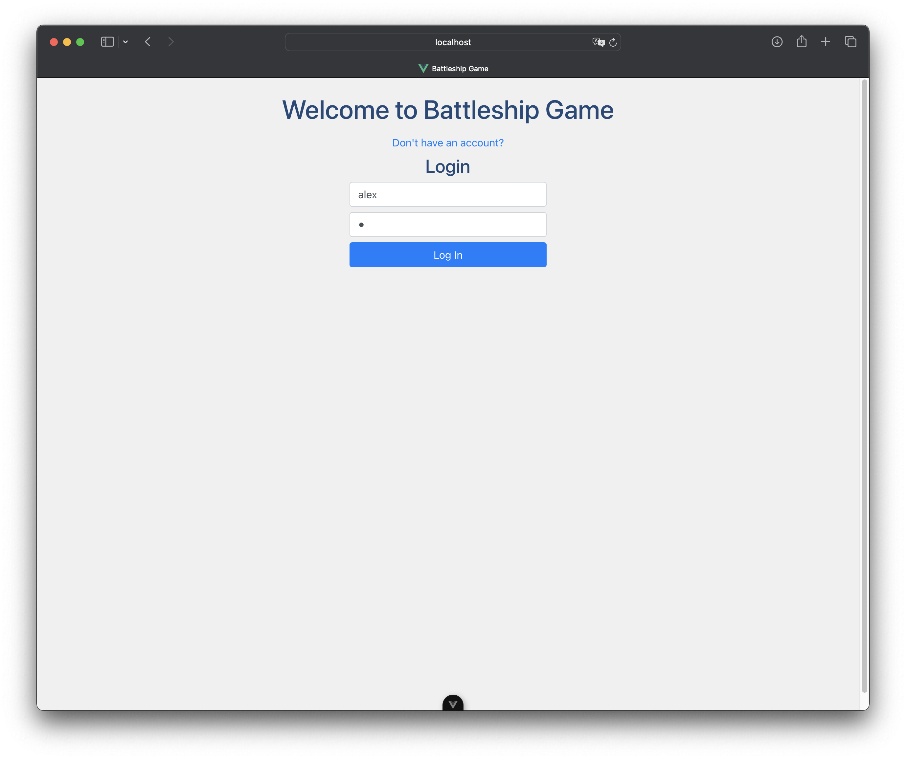

**Registre de nous usuaris:**
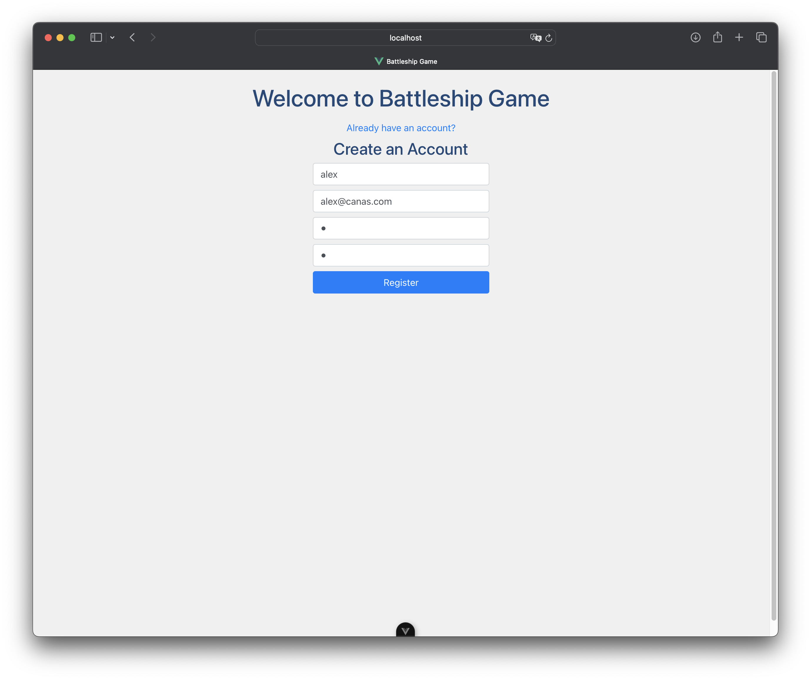

**Pantalla principal amb historial de partides:**
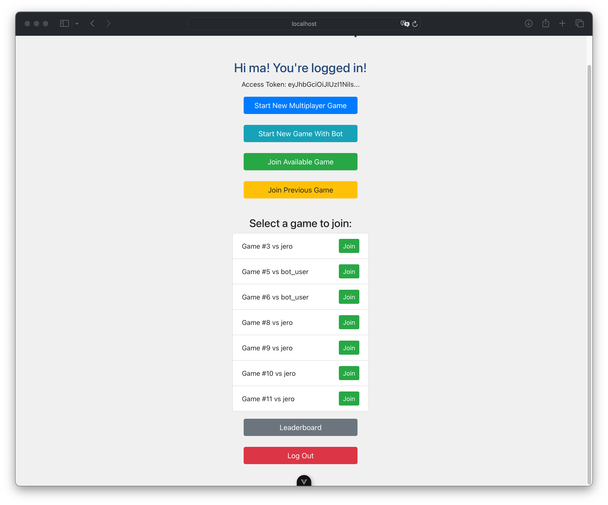

### Col·locació de vaixells

**Mode multijugador - Col·locació de vaixells:**
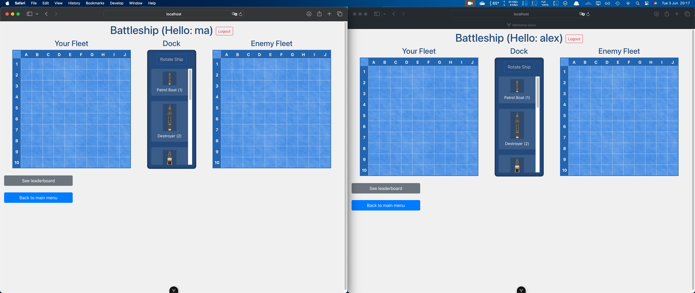

**Mode bot - Col·locació de vaixells:**
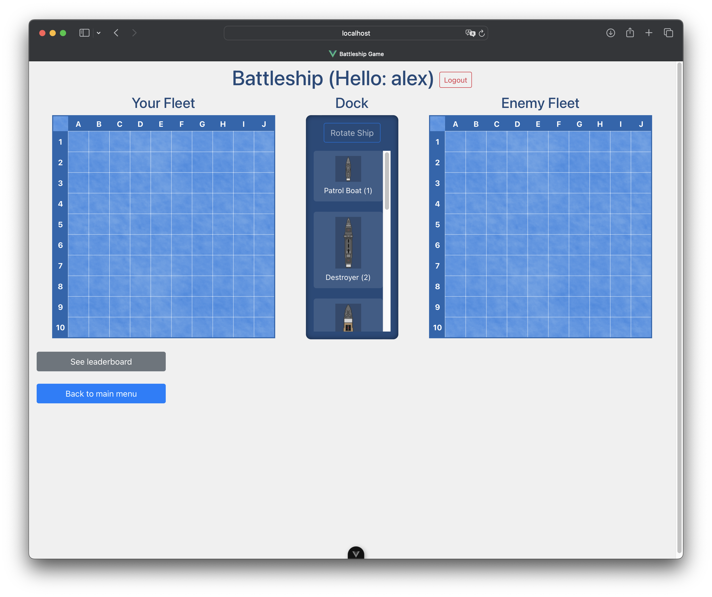

**Esperant que l'oponent col·loqui els vaixells:**
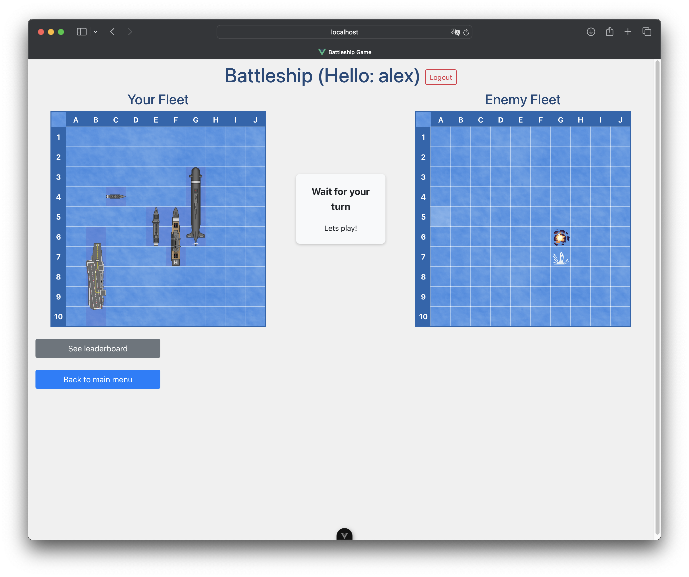

**Mode multijugador - Esperant l'altre jugador:**
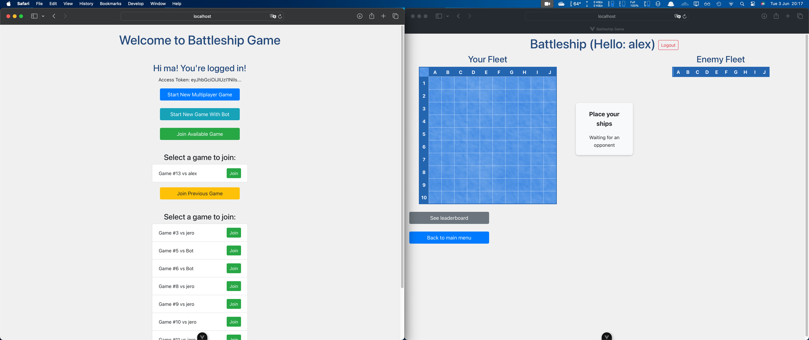

### Joc en funcionament

**Jugant contra el bot:**
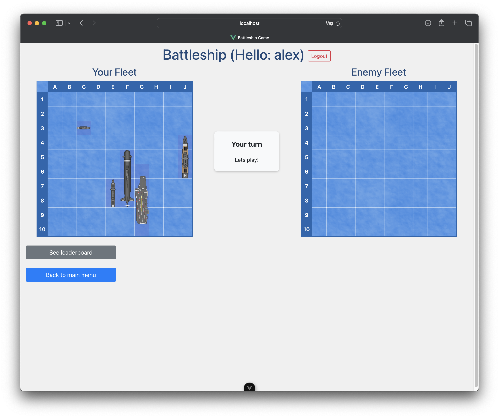

**Partida multijugador en curs:**
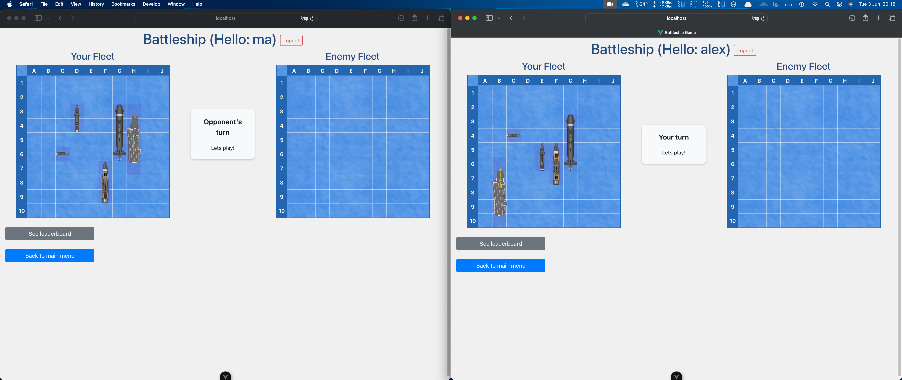

**Pantalla de victòria:**
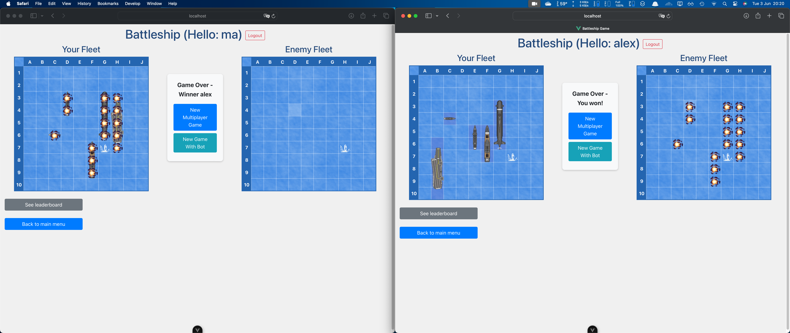

### Leaderboard

**Classificació de jugadors:**
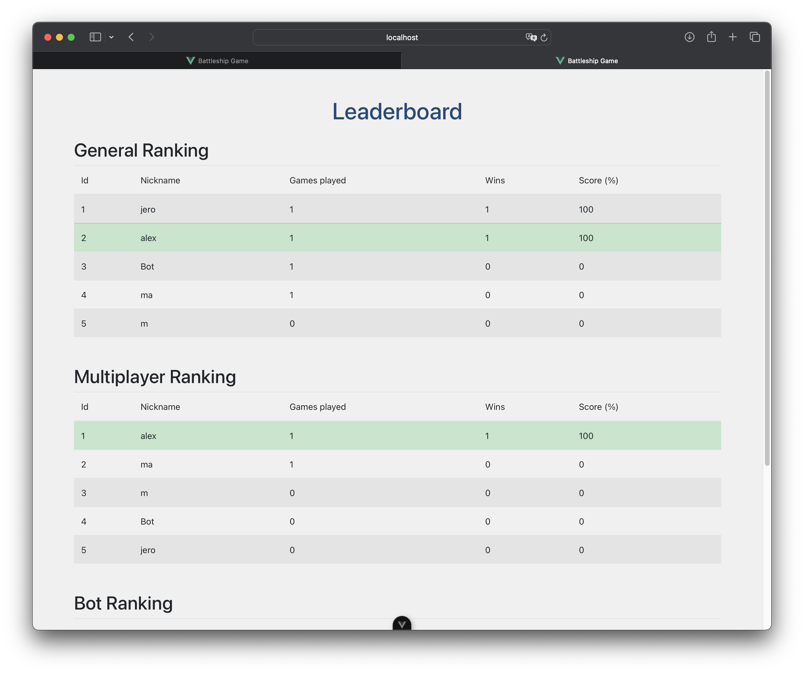

## Informació de desplegament

### Backend (Django)
```bash
cd backend
poetry install
poetry run python manage.py migrate
poetry run python manage.py runserver
```

### Frontend (Vue.js)
```bash
cd frontend
npm install
npm run dev
```

### Variables d'entorn
- `VITE_API_URL`: URL del backend API
- `DJANGO_SECRET_KEY`: Clau secreta de Django
- `DJANGO_DEBUG`: Mode debug (True/False)

### Endpoints principals
- Backend API: `http://localhost:8000`
- Frontend: `http://localhost:5173`
- Documentació API: `http://localhost:8000/docs/`
- Health Check: `http://localhost:8000/ht/`

### Base de Dades
- Utilitzem SQLite per desenvolupament
- Les migracions es creen automàticament
- Dades inicials dels vaixells es carreguen per signals

## Arquitectura del sistema

### Models de dades
- **Player**: Jugadors del sistema
- **Game**: Partides amb configuració i estat
- **Board**: Taulers dels jugadors
- **Vessel**: Tipus de vaixells disponibles
- **BoardVessel**: Vaixells col·locats en taulers
- **Shot**: Trets realitzats durant les partides

### API Endpoints
- `/api/v1/games/`: Gestió de partides
- `/api/v1/players/`: Gestió de jugadors
- `/api/v1/vessels/`: Consulta de vaixells
- `/api/v1/leaderboard/`: Estadístiques
- `/api/token/`: Autenticació JWT

### Frontend Components
- `GameBoard.vue`: Component del tauler de joc
- `DockingArea.vue`: Àrea de col·locació de vaixells
- `Header.vue`: Capçalera de l'aplicació
- Stores: Gestió d'estat amb Pinia

## Conclusions

Considerem que el nostre és un Battleship completament funcional amb una arquitectura distribuïda. Hem complert la majoria dels objectius proposats, creant una aplicació robusta amb frontend i backend ben separats.

Les principals fites aconseguides han estat:
- Sistema complet de joc amb totes les regles del Battleship
- API REST ben estructurada i documentada
- Interfície d'usuari intuïtiva, robusta davant inputs erronis i responsive
- Sistema d'autenticació segur
- Mode multijugador i contra bot

En aquest projecte hem treballat els principis del desenvolupament d'aplicacions distribuïdes i l'ús d'tecnologies modernes com Django REST Framework i Vue.js.
